# Hi, I'm Mahmoud Kamal 👋

Welcome to my GitHub profile! I'm a passionate full-stack developer with experience in building scalable web applications and mobile apps. I specialize in the **MERN stack** and **Next.js** but also have experience with a wide range of technologies.

---

## 🚀 Skills & Technologies

### **Languages & Frameworks**
- JavaScript (ES6+)
- PHP
- Python
- HTML5, CSS3, SASS
- TailwindCSS, Bootstrap
- React.js, Next.js, React Native
- Flask

### **Backend & Databases**
- Node.js, Express.js
- MongoDB, MySQL, PostgreSQL, Oracle
- Firebase

### **Tools & Technologies**
- Git, Docker, Kubernetes
- JWT, REST APIs, Redux
- Webpack, AWS, Google Cloud

---

## 🔧 Featured Projects

### **1. E-commerce App**
A fully-featured **E-commerce app** built using the **MERN stack** and **Next.js**, with:
- **User authentication**
- **Product management**
- **Admin dashboard**

#### 🖼️ Screenshots:

  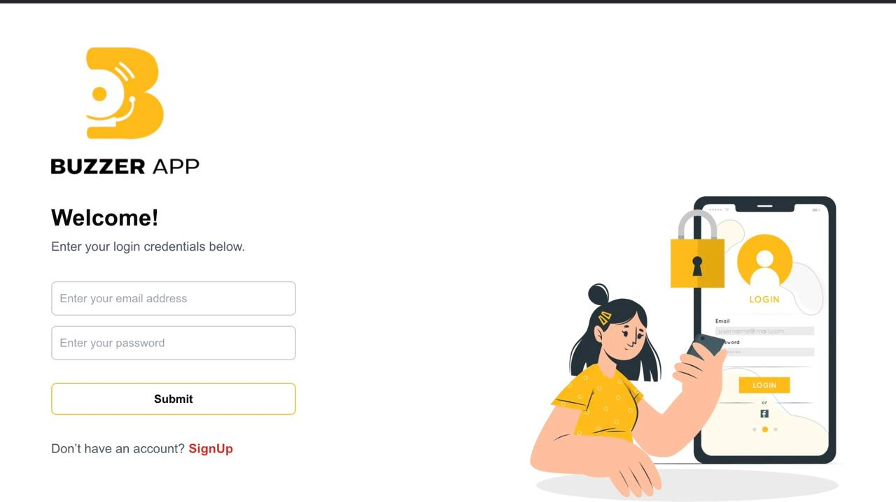
  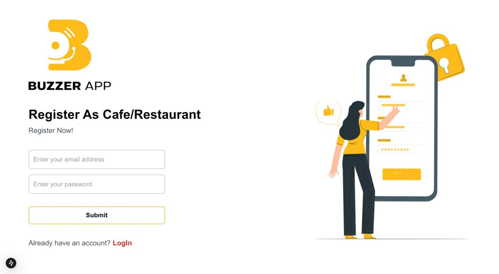
  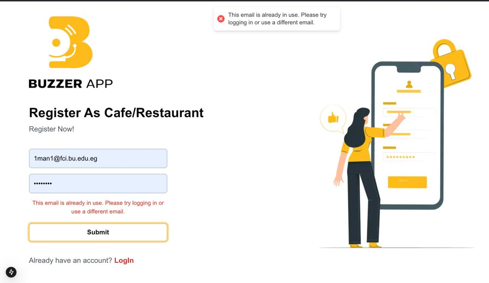
  <!-- Repeat for remaining images -->

   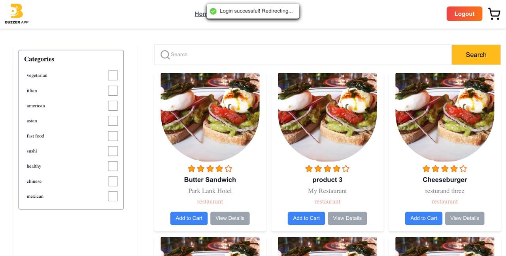
  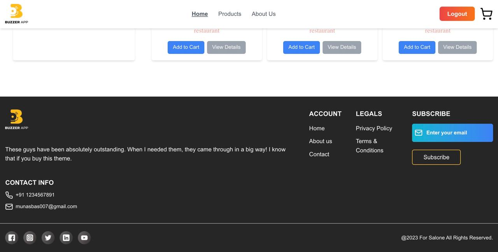
  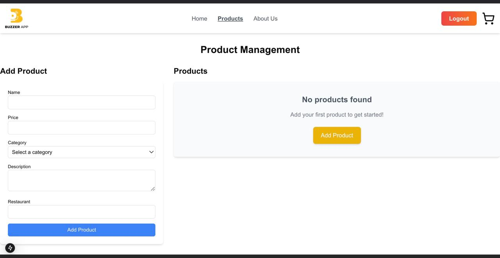

   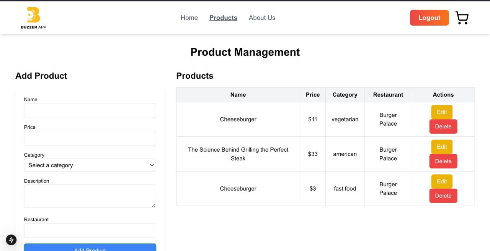
  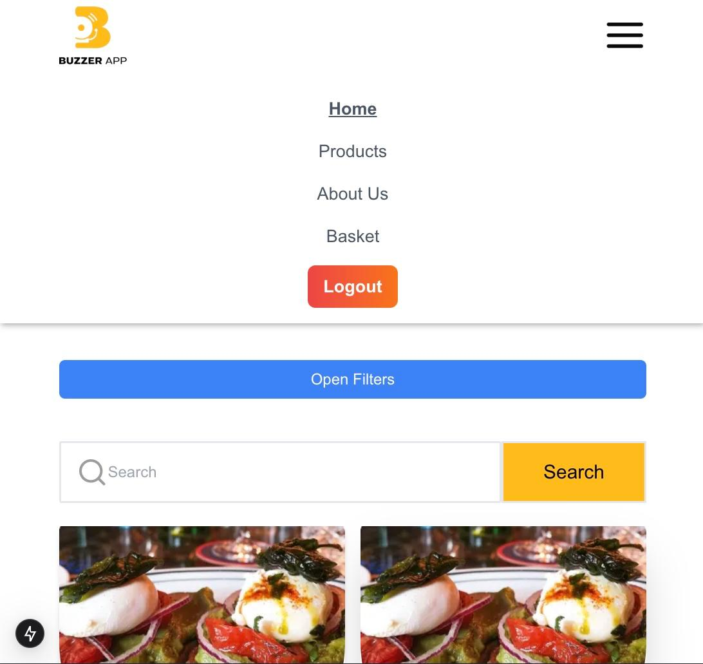
  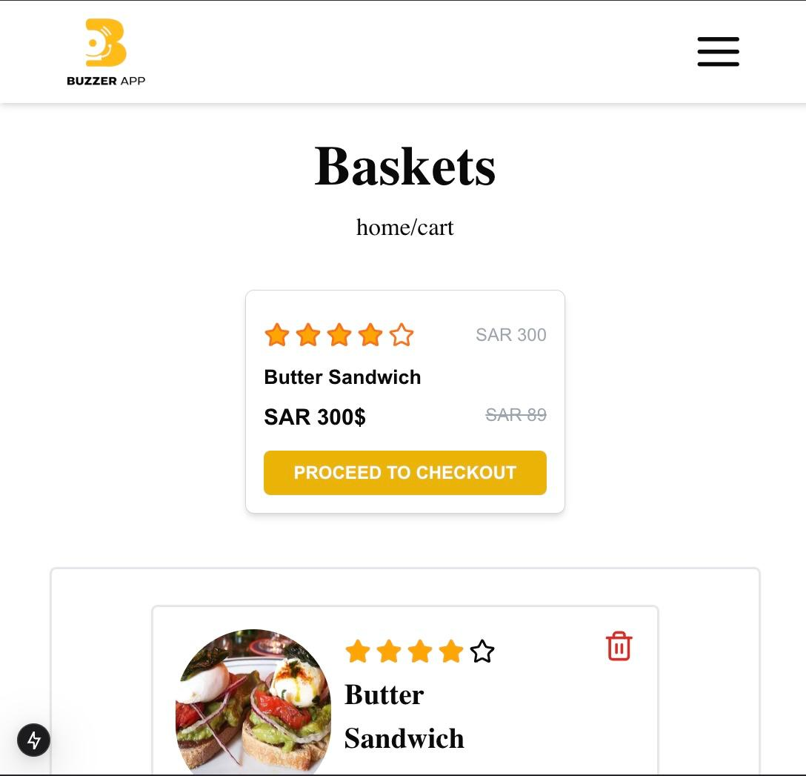

   
  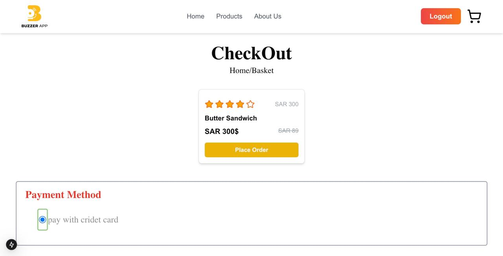
  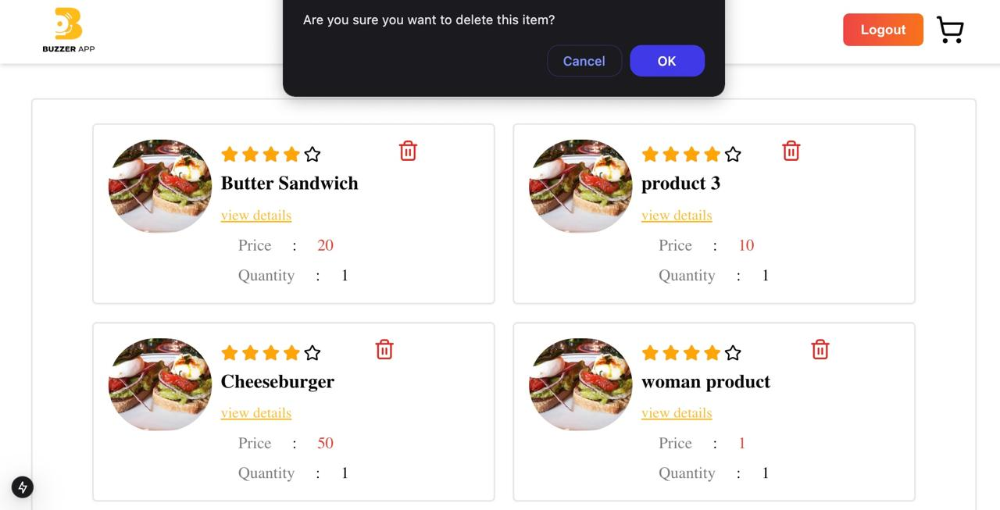

   
  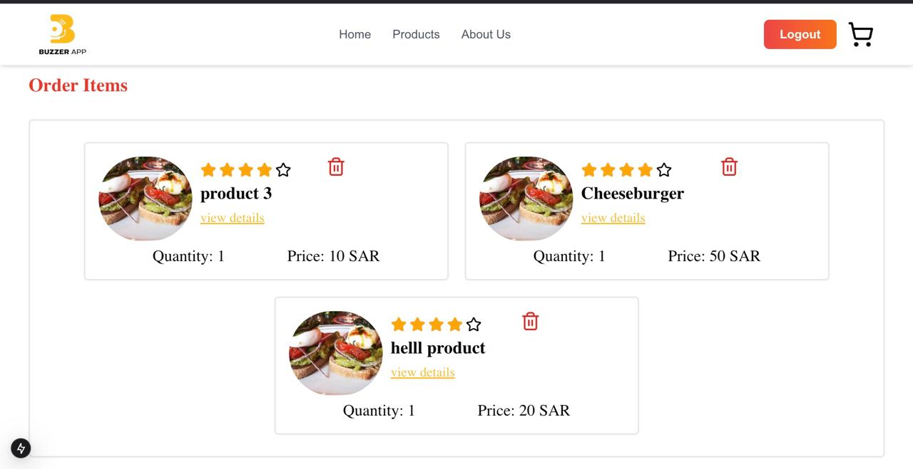
  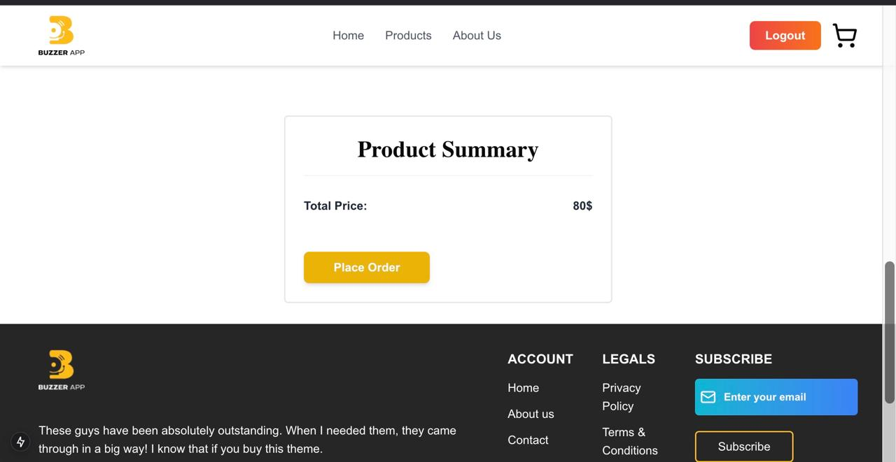

   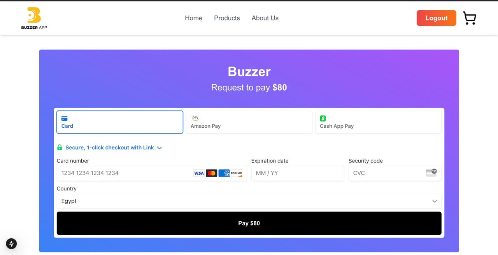
  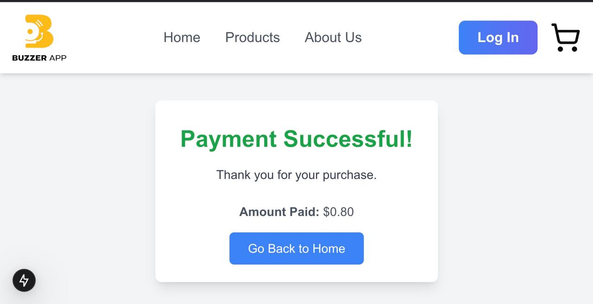

#### 🛠️ Technologies:

---

### **2. Finance Management App**
A robust **finance management app** developed using **MERN stack** with:
- **JWT authentication**
- **Interactive frontend**
- **Admin management tools**

#### 🖼️ Screenshots:

  
  

#### 🛠️ Technologies:

---

### **3. Cross-Platform Mobile App**
Built a **cross-platform mobile app** using **React Native** for both **iOS** and **Android**, with:
- Firebase backend
- Real-time data syncing

#### 🖼️ Screenshot:

  

#### 🛠️ Technologies:

---

## 🌱 Currently Learning
- Advanced **TypeScript**
- **Kubernetes** for container orchestration
- Cloud services: **AWS**, **Google Cloud**

---

## 📫 Connect with Me

- [LinkedIn](https://www.linkedin.com/in/mahmoud-kamal-a98123284)
- [YouTube](https://www.youtube.com/@OverStarWeb/videos)
- [Portfolio](your-portfolio-link)
